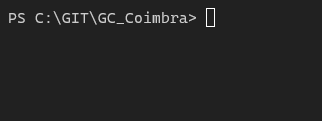
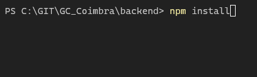
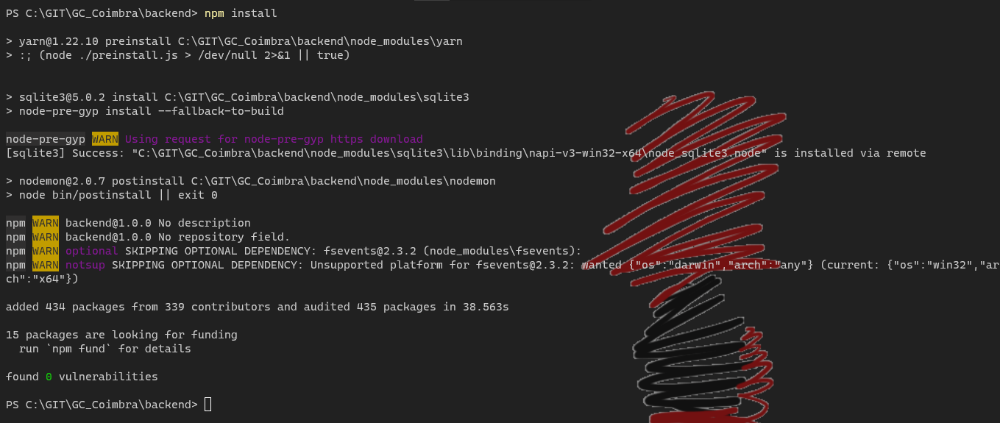
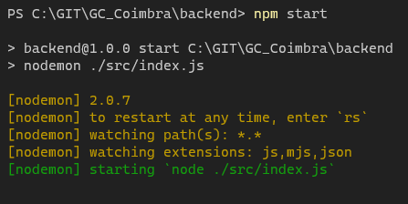
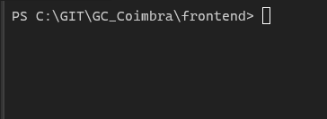
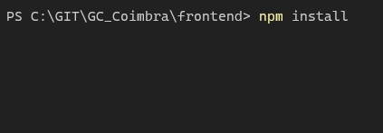
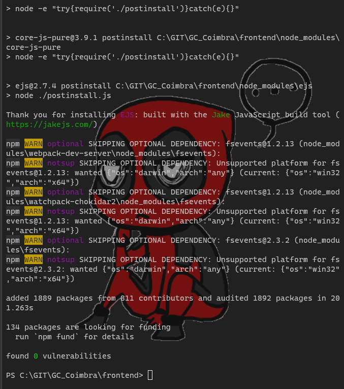

# Projeto De Gestão de Contrato

<h2>Configurando o ambiente</h2>

> Primeiro para que tudo der certo devemos ter o nodejs instado 
[Nodejs](https://nodejs.org/en/), com a versão 14.16.0 LTS

* <h3>Nessa Etapa ele ira pedir pra instalar o Chocolatey mas não precisa.</h3>

<h2> Depois que o nodejs ja estiver instalado, vamos para o terminal e entraremos no diretorio do projeto</h2>

* <h3> No meu fica assim 

* <h3>Agora entraremos no diretorio backend e então digitar o seguinte comando 

<h3> Agora que terminou vamo rodar o projeto backend digitando o comando:

**npm start**

<h2> Agora vamos rodar o projeto no frontend</h2>

* <h3> Sem fecha o terminal do backend vamos abrir outro terminal e entra no projeto até o diretorio backend 

    **C:\GIT\GC_Coimbra\frontend>**

    

    <h3> Então rodaremos o mesmo comando para instalar os pacotes

    **npm install**

    \
    

    * Agora com os pacotes instalado vamos rodar o projeto com o comando
    **npm start**

    * Ele vai entrar sozinho no navegar direto no projeto caso não entre o diretorio padrão e http://localhost:3000/

# Utilizando

<h3> O projeto contara com duas telas uma de listagem e outra para adicionar contratos.

* A tela de listagem mostrar todos os projetos e só ira começar a filtrar apartir do momento que for montando o filtro nos campos
     * Nessa mesma tela mostra o caixa com informações do contrato e cada um contrato terá um botão para saber mais onde abrira outra tela mostrando todas as informações do contrato.

* A tela de Cadastro de contrato foi feita para que todos os campos sejam preenchidos sendo assim obrigario completar todos todos os campos.

# Como foi feito

<h3> O projeto foi feito em ReactJs, Nodejs, e como SGBD foi usado o Sqlite3.
    
    * Para montar o backend foi usando o Nodejs
    * E para o frontend foi usado o ReactJs
<h3> Programas Usados para testa o funcionamento do backend</h3>

* [Insomnia](https://insomnia.rest/)

* [DB Browser](https://sqlitebrowser.org/)