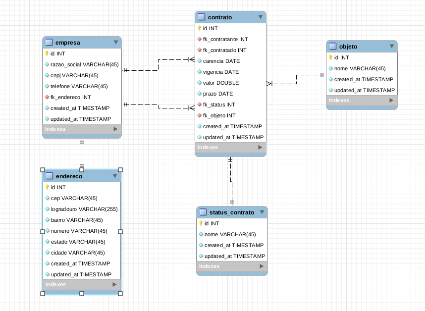

## Sobre 

### Nome: Vinicius da Rosa Pereira

### E-mail: viniciusrosa444@gmail.com
### Linkedin: https://www.linkedin.com/in/vinicius-pereira-a404a5140/

## Introdução

Sistema criado em `Laravel`, usando banco de dados em `MySQL`, para a iniciar o projeto siga os seguintes passos:

* Crie a base de dados que está em `database/gestao_contrato.sql` 
* Depois configure o .env configurando apenas:
    - `DB_HOST:`  
    - `DB_PORT:`  
    - `DB_DATABASE:`  
    - `DB_USERNAME:`  
    - `DB_PASSWORD:`  
* Depois use o comando em seu terminal: `php artisan serve`
* Após iniciado o comando irá gerar um host:port, pasta entrar no endereço para visualizar o projeto

## Modelagem do banco

## Possiveis erros

* Um possivel erro pode ser um erro de permissão na pasta `storage`, mas caso ocorra libere todas as permissões na pasta do projeto 
* Caso ocorra um erro sobre chave use o comando no terminal: `php artisan key:generate`
